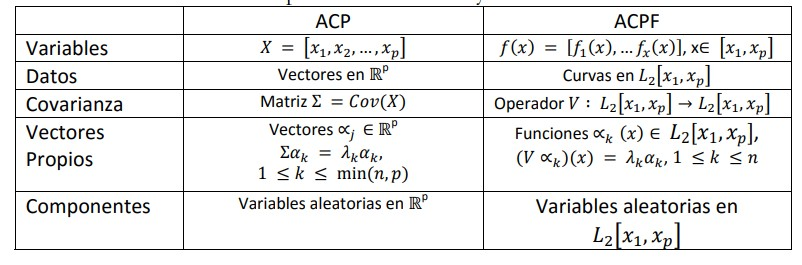
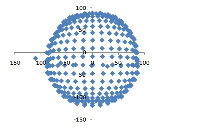
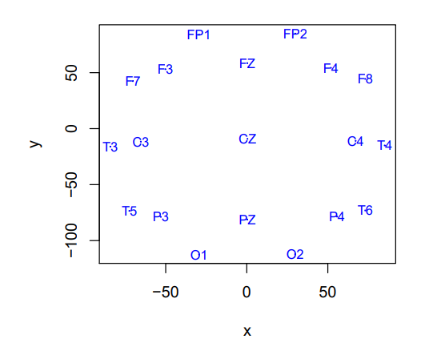

# Análisis de datos funcionales

## Análisis de datos funcionales (ADF) - Análisis exploratorio


### Datos funcionales
#### Descripción

Los desarrollos tecnólogicos han hecho posible que los investigadores de muchas áreas dispongan de grandes volúmenes de información para un mismo individuo. Usualmente éstos datos pueden ser representados a través de curvas o en general de funciones.

En el ADF la unidad básica de información es la función completa, más que un conjunto de valores (Ramsay and Dalzell, 1991), es decir, que un dato funcional se puede establecer como la extensión de medidas repetidas cuando la cantidad de mediciones ($M$) en un determinado individuo es muy grande.

Ferraty and Vieu (2006) definen una variable aleatoria funcional $\chi$, como una variable aleatoria que toma valores en un espacio de funciones, es decir, un espacio infinito dimensional (espacio funcional). Una observación $x$ de la variable aleatoria $\chi$ se denomina dato funcional.

Un conjunto de datos funcionales $x_1, x_2, ..., x_n$ es la observación de $n$ variables funcionales distribuidas como $\chi$. Un dato funcional $x_i(t), t ∈ T = [a, b] ⊂ R$, es representado usualmente como un conjunto finito de pares $(t_j, x_{ij})$ con $t_j$ $\in$ $T$, $j = 1, 2, ..., M$, dónde $M$ representa la cantidad de puntos en los cuales es observada la variable de interés y $y_{ij} = \chi_i(t_j)$ (si no existe error observacional) o $y_{ij} = \chi_i(t_j) + ε_j$ (en caso contrario).

Por ejemplo, consideremos la temperatura promedio mensual de la superficie del océano en grados Celsius, registrada desde Enero de 1982 a Abril de 2022, disponible en:<https://www.cpc.ncep.noaa.gov/data/indices/sstoi.indices>.


Realizamos la lectura de los datos:

```{r cars01 }
rm(list=ls())
library(fda)
library(fda.usc)
library(rainbow)
library(MASS)
library(xtable)

Datos =read.delim2("data_11_PatronesPuntuales/1_AnalisisExploratorio/sstoi.indices1.txt",header=T,dec=".", sep = "\t")
summary(Datos)

```

Reorganizamos la información para que cada año sea una curva. No tenemos en cuenta el año 2022 por no disponer de la información de todo el año.

```{r cars02}
temp <- matrix(Datos$NINO1.2[-c(481:484)], nrow=12, 40)
colnames(temp)=c(1982:2021)
```
Construimos las gráficas para cada año

```{r pressure01}
month<-1:12
plot(month, temp[,1], type="b", ylim=c(18, 30), xlab="Mes", ylab="temperatura")
for(i in 2:ncol(temp))
lines(month, temp[,i], type="b", col=i)

```


#### Suavizamiento de curvas

Una herramienta no paramétrica de mucha utilidad en el ADF es el suavizado de curvas a través de funciones. El procedimiento consiste en aproximar las funciones del espacio considerado a través de (Ramsay and Silverman, 2005):

\begin{equation}
\chi(t) = \sum_{l=1}^K c_lB_l(t) = c'B(t)
\end{equation}
dónde K es el número de funciones de la base.

En la literatura exisste varias funciones base que permiten desarrollar la expansión. La selección del tipo de funciones de la base depende de las caracteríticas que cumpla que fenómeno de estudio. Por ejemplo, las series de Fourier se utilizan para funciones con comportamientos cíclicos o periódicos y las bases monomiales se utilizan cuando existen tendencias simples que pueden ser ajustadas mediante líneas rectas, polinomios cuadráticos, polinomios de orden superior, etc. Las bases más usuales son aquellas basadas en splines debido a que son más flexibles y se ajustan de mejor manera a diferentes comportamientos. Dentro de estas se encuentran B-splines, M-splines, I-splines, y fucniones de potencia truncadas.


##### Bases monomiales

Las bases monomiales requieren el dominio y el número de base. Por ejemplo, la base monomial con K=6 funciones de base definidas en el intervalo [0,1] se puede construir con:


```{r cars03}
library(fda)
bbasis_obj = create.monomial.basis(rangeval=c(0,1), nbasis = 6)

```

Esto devolverá una salida de "funciones". Para evaluar las bases en una cuadrícula de puntos $s$, debemos:

```{r cars04}
library(fda)
x <- seq(0,1,length.out=100)
bbasisevals <- eval.basis(x, bbasis_obj)
# dim(basisevals)
matplot(x, bbasisevals, type='l', lty=1, col=rainbow(6),
        xlab="x", ylab="bases", 
        main="base monomial con k = 6")

```

##### Bases de Fourier

Para utilizarlas bases de Fourier se requiere que se defina el dominio, el período de oscilación y el número de funciones de base.

```{r cars05}
fbasis_obj <- create.fourier.basis(rangeval=c(0,1), 
                                   nbasis=65, period = 1)
fbasisevals <- eval.basis(x, fbasis_obj)
matplot(x, fbasisevals[, 1:3], type='l', lty=1, col=rainbow(3),
        xlab="x", ylab="bases", 
        main="Primeras tres bases de Fourier")
```


##### B-splines

Las bases B-spline requieren el dominio, el número de funciones de la base y el orden.

```{r cars06}
bsbasis_obj <- create.bspline.basis(rangeval=c(0,1),
                                    nbasis=10, norder=4)
bsbasisevals <- eval.basis(x, bsbasis_obj)
matplot(x, bsbasisevals, type='l', lty=1, col=rainbow(15),
        xlab="x", ylab="bases", 
        main="B-spline cubica con K = 10")
```


##### Otras bases

El paquete \bold{fda} también se puede usar para construir otros tipos de bases. Para revisar la lista de bases disponibles se puede utilizar $ ?create. + tab$ 

##### Suavizamiento de la temperatura 


La temperatura es una variable que se puede tomar en intervalos más pequeños (diaria, cada hora, etc). Es decir, al realizar la gráfica anterior estamos suponiendo que podemos discretizar la variable de temperatura a través de la medición mensual.La primera tarea es convertir estos valores discretos en una función que puede tomar valores en cualquier valor de argumento deseado $x_i(t)$. Si se supone que estas observaciones no presentan un término de error asociado, el proceso de generación de la función (curva) será un proceso de interpolación, pero si tienen algún
error observacional que necesita modelarse, entonces la conversión de datos (finitos) a funciones (que teóricamente se pueden evaluar en un número infinito de puntos) se enmarca en los procesos de suavizamiento.

En consecuencia, requerimos una estrategia para construir funciones con parámetros que sean fáciles de estimar y que puedan ajustarse casi a cualquier característica de la curva. Por otro lado, no queremos usar más parámetros de los que necesitamos, ya que hacerlo aumentaría en gran medida el tiempo de cálculo y complicar los análisis. Para el caso de la temperatura se utiliza una B-spline de orden 4.

```{r cars07}

BSpl <- create.bspline.basis(norder=4, breaks=seq(0,12,length=5))
plot(BSpl)
Ftemp <- Data2fd(temp, basisobj=BSpl)
plot(Ftemp, main="Datos suavizados de la Temperatura", xlab = "Mes", ylab = "Temperatura oC",
ylim=c(18,30))
```

En el proceso de suavizamiento es necesario tener en cuenta la rugosidad como un aspecto fundamental. El método utilizado para aproximar funciones mediante una base de funciones B-splines se basa en minimizar el sistema:

\begin{equation}
GCV = \min_c \sum_{j =1}^M (y_j - S(t_j))^2 + \lambda\int_t (S''(t)dt)
\end{equation}

con $\lambda$ un parámetro de penalización para disminuir la variabilidad del ajuste. El número de funciones base (K) y el coeficiente $\lambda$ son estimados a través de procedimientos de validación cruzada
(Ramsay and Silverman, 2005). Con el siguiente programa se puede establecer la estimación del parámetro de suavizamiento óptimo.

```{r cars08}
loglam = seq(0,0.05,0.001)
nlam = length(loglam)
dfsave = rep(NA,nlam)
gcvsave = rep(NA,nlam)
for (ilam in 1:nlam) {
lambda = loglam[ilam]
fdParobj = fdPar(BSpl, Lfdobj=NULL, lambda= lambda)
smoothlist = smooth.basis(1:12, temp, fdParobj)
dfsave[ilam] = smoothlist$df
gcvsave[ilam] = sum(smoothlist$gcv)
}
plot(loglam,gcvsave,xlab=expression(lambda),ylab=expression(GCV(lambda)),
main="Parámetros de suavizamiento versus GCV",type="b",cex=0.7)
```

Tomando como referencia los 40 añoos reportados (de 1982 a 2021) en la base de datos de interés, se evidencia que el punto que minimiza la estadística GCV se encuentra alrededor de $\nu$ = 0.017 con valores muy superiores antes de 0.01 y después de 0.04. Se destaca que dicho parámetro minimiza la suma del criterio GCV de todas las 40 curvas que se encuentran dentro de la muestra, es decir, el valor de dicho parámetro resulta ser el óptimo en relación con el proceso de suavizamiento de todas las curvas dentro de la muestra. 


#### Estadística descriptiva

Dado un conjunto de datos funcionales $x_1, x_2, ..., x_n$ definidos en $t ⊂ T ∈ R$, las correspondientes funciones descriptivas están dadas por las expresiones (Ramsay and Silverman, 2005):

$Media:\bar{\chi}(t) = \frac{\sum_{i=1}^n \chi_i(t)}{n}$

$Varianza: Var(\chi(t)) = \frac{\sum_{i=1}^n (\chi_i(t) - \bar{\chi}(t))^2}{n}$

$Desviación estándar: \sigma(\chi(t)) = \sqrt{var(\chi(t)}$

Así, se puede concluir que las estadísticas descriptivas univariadas clásicas se
aplican igualmente cuando se tienen datos funcionales. Sin embargo se resalta que en este
caso, los objetos calculados corresponden a curvas.

```{r cars09}
meanfdh <- mean.fd(Ftemp)
varfdh <-var.fd(Ftemp)
stdvfdh <- stddev.fd(Ftemp)
plot(Ftemp,col=8, lty=1, xlab = "Mes", ylab = "Temperatura oC")
lines(meanfdh,col=2,lwd=2)
par(mfrow=c(1,2))
plot(varfdh, main=" Superficie de varianza", xlab = "t", ylab = "s")
plot(stdvfdh, main="Desviación estándar", xlab = "Mes", ylab = "Temperatura oC")
```


### Análisis gráfico y detección de outliers

Es posible realizar detección de datos atípicos (outliers) a través de las herramientas: bagplot, HDR y boxplot para datos funcionales. 
 
Con respecto a la base de datos de la temperatura, utilizando las profundidades dadas a través del criterio de bagplot, se muestran nueves curvas atípicas. La identicación de las curvas se encuentra en la parte superior del panel izquierdo de la siguiente figura. Se destaca, que el factor de inflación utilizado en este caso toma el valor de 1.96 que es el establecido por defecto en la función tipo bag.
 
```{r cars10}
TempTs = sfts(ts(as.numeric(temp), start = c(1982,1),frequency = 12), xname = "Mes",
yname = "Temperatura oC")
par(mfrow=c(1,2))
fboxplot(data= TempTs, plot.type = "functional", type = "bag", projmethod = "PCAproj")
fboxplot(data= TempTs, plot.type = "bivariate", type = "bag", projmethod = "PCAproj",
ylim = c(-6,6), xlim = c(-15,6))
```

Análogamente, teniendo en cuenta la profundidad a través del criterio de HDR plot, se evidencian dos curvas atípicasicas identificadas con los años 1997 y 2015. Para este caso los porcentajes de cobertura de los datos atipicos y de la región central tenidos en cuenta fueron los establecidos por defecto en la respectiva función (0.05, 0.5).

```{r cars11}
par(mfrow=c(1,2))
fboxplot(data= TempTs, plot.type = "functional", type = "hdr", projmethod = "PCAproj")
fboxplot(data= TempTs, plot.type = "bivariate", type = "hdr", projmethod = "PCAproj",
ylim = c(-6,6), xlim = c(-15,6))

```

Finalmente, al utilizar la herramienta del boxplot funcional, teniendo en cuenta la profundidad dada por la versión modificada de Band-depth, existe una curva atípica (1990). La probabilidad de la región central utilizada para realizar el gráfico fue de 0.5.

```{r cars12}
par(mfrow=c(1,1))
fbplot(fit= temp, method = "BD2", xlab = "Mes", ylab = "Temperatura oC")

```

Al comparar la detección de datos atípicos utilizando las tres herramientas mencionadas
(bagplot, hdr plot y fbplot) en la muestra de las 40 curvas de temperatura, se evidencia que el bagplot resulta ser la herramienta más estricta o exigente en cuanto a que detecta nueve curvas como atípicas, mientras que las otras dos detectaron dos y una, respectivamente. Es importante destacar que, lo que permite comparar las diferentes herramientas en términos de exigencia es utilizar las opciones de probabilidades de cobertura y factor de infación establecidas por defecto.

```{r cars13}

par(mfrow=c(1,1))
MedFM = fdepth(data = TempTs, type = "FM", trim = 0.1)
plot(MedFM)
MedRP = fdepth(data = TempTs, type = "RP", trim = 0.1)
plot(MedRP)
MedRPD = fdepth(data = TempTs, type = "RPD", trim = 0.1)
plot(MedRPD)
```


## Análisis de datos funcionales (ADF) - Análisis gráfico

Por ejemplo, consideremos la temperatura promedio mensual de la superficie del océano en grados Celsius, registrada desde Enero de 1982 a Abril de 2022, disponible en:<https://www.cpc.ncep.noaa.gov/data/indices/sstoi.indices>.


Realizamos la lectura de los datos:

```{r cars14, warning=FALSE, cache=FALSE, message=FALSE }
library(fda)
library(fda.usc)
library(rainbow)
library(MASS)
library(xtable)

Datos =read.delim2("data_11_PatronesPuntuales/2_AnalisisGrafico/sstoi.indices1.txt",header=T,dec=".", sep = "\t")
summary(Datos)

```

Reorganizamos la información para que cada año sea una curva. No tenemos en cuenta el año 2022 por no disponer de la información de todo el año.

```{r cars15, warning=FALSE, cache=FALSE, message=FALSE}
temp <- matrix(Datos$NINO1.2[-c(481:484)], nrow=12, 40)
colnames(temp)=c(1982:2021)
```
Construimos las gráficas para cada año

```{r pressure02}
month<-1:12
plot(month, temp[,1], type="b", ylim=c(18, 30), xlab="Mes", ylab="temperatura")
for(i in 2:ncol(temp))
lines(month, temp[,i], type="b", col=i)

```

### Deteccción de curvas atípicas

Es posible realizar detección de datos atípicos (outliers) a través de las herramientas: bagplot, HDR y boxplot para datos funcionales. 
 
Con respecto a la base de datos de la temperatura, utilizando las profundidades dadas a través del criterio de bagplot, se muestran nueves curvas atípicas. La identicación de las curvas se encuentra en la parte superior del panel izquierdo de la siguiente figura. Se destaca, que el factor de inflación utilizado en este caso toma el valor de 1.96 que es el establecido por defecto en la función tipo bag.
 
```{r cars16, warning=FALSE, cache=FALSE, message=FALSE}
TempTs = sfts(ts(as.numeric(temp), start = c(1982,1),frequency = 12), xname = "Mes",
yname = "Temperatura oC")
par(mfrow=c(1,2))
fboxplot(data= TempTs, plot.type = "functional", type = "bag", projmethod = "PCAproj")
fboxplot(data= TempTs, plot.type = "bivariate", type = "bag", projmethod = "PCAproj",
ylim = c(-6,6), xlim = c(-15,6))
```

Análogamente, teniendo en cuenta la profundidad a través del criterio de HDR plot, se evidencian dos curvas atípicas identificadas con los años 1997 y 2015. Para este caso los porcentajes de cobertura de los datos atípicos y de la región central tenidos en cuenta fueron los establecidos por defecto en la respectiva función (0.05, 0.5).

```{r cars17, warning=FALSE, cache=FALSE, message=FALSE}
par(mfrow=c(1,2))
fboxplot(data= TempTs, plot.type = "functional", type = "hdr", projmethod = "PCAproj")
fboxplot(data= TempTs, plot.type = "bivariate", type = "hdr", projmethod = "PCAproj",
ylim = c(-6,6), xlim = c(-15,6))

```

Finalmente, al utilizar la herramienta del boxplot funcional, teniendo en cuenta la profundidad dada por la versión modificada de Band-depth, existe una curva atípica (1990). La probabilidad de la región central utilizada para realizar el gráfico fue de 0.5.

```{r cars18, warning=FALSE, cache=FALSE, message=FALSE}
par(mfrow=c(1,1))
fbplot(fit= temp, method = "BD2", xlab = "Mes", ylab = "Temperatura oC")

```

Al comparar la detección de datos atípicos utilizando las tres herramientas mencionadas (bagplot, hdr plot y fbplot) en la muestra de las 40 curvas de temperatura, se evidencia que el bagplot resulta ser la herramienta más estricta o exigente en cuanto a que detecta nueve curvas como atípicas, mientras que las otras dos detectaron dos y una, respectivamente. Es importante destacar que, lo que permite comparar las diferentes herramientas en términos de exigencia es utilizar las opciones de probabilidades de cobertura y factor de infación establecidas por defecto.

### Otras medidas de resumen

Con datos funcionales también es posible calcular otras etadísticas de resumen como la moda, medias recortadas y la mediana. 

```{r cars19, warning=FALSE, cache=FALSE, message=FALSE}

#*********************************************************
#Parámetros estimados - Media recortada al 10%
#*********************************************************
par(mfrow=c(1,1))
###Calcula la profundidad de Fraiman and Muniz (2001)
MedFM = fdepth(data = TempTs, type = "FM", trim = 0.1)
plot(MedFM)
###Calcula la profundidad a través de proyecciones aletorias de Cuevas et al. (2007)
MedRP = fdepth(data = TempTs, type = "RP", trim = 0.1)
plot(MedRP)
MedRPD = fdepth(data = TempTs, type = "RPD", trim = 0.1)
plot(MedRPD)

#***********************************************************
#Parametros estimados - Moda
#***********************************************************
MODA = fdepth(data = TempTs, type = "mode", trim = 0.1)
plot(MODA)

```

Finalmemnte, a través de procedimientos bootstrap es posible estimar intervalos de confianza para las medidas de resumen.

```{r cars20, warning=FALSE, cache=FALSE, message=FALSE}
#***********************************************************
#Boostrap Funcional
#***********************************************************


BSpl <- create.bspline.basis(norder=4, breaks=seq(0,12,length=5))
Ftemp <- Data2fd(temp, basisobj=BSpl)
plot(Ftemp, main="Datos suavizados de la Temperatura", xlab = "Mes", ylab = "Temperatura oC",
ylim=c(18,30))

out.boot1=fdata.bootstrap(Ftemp,statistic=func.mean,nb=200,draw=TRUE)
out.boot2=fdata.bootstrap(Ftemp,statistic=func.trim.FM,nb=100,draw=TRUE)
out.boot2=fdata.bootstrap(Ftemp,statistic=func.trim.mode,nb=100,draw=TRUE, trim = 0.1)
out.boot2=fdata.bootstrap(Ftemp,statistic=func.trim.RP,nb=100,draw=TRUE, trim = 0.1)

```

### Análisis en Componentes Principales (ACPF)

El análisis de componentes principales funcionales (ACPF) es una extensión del ACP clásico en el que las componentes principales están representadas por funciones y no por vectores (Ramsay & Sylverman, 2005). La idea fundamental del análisis de componentes principales es reducir la dimensión del conjunto de datos conservando tanto como sea posible la variación presente en los mismos. 

{width='500px'}

Fuente: Chávez-Chong,Sánchez-García y DelaCerda-Gastélum (2015), disponile en <https://rio.upo.es/xmlui/bitstream/handle/10433/2768/1694-5314-1-SM.pdf?sequence=1&isAllowed=y#:~:text=AN%C3%81LISIS%20DE%20COMPONENTES%20PRINCIPALES%20(ACP)&text=Es%20decir%3A%20reducir%20la%20dimensi%C3%B3n,la%20biometr%C3%ADa%20de%20la%20%C3%A9poca>.


Si se aplica el método a las curvas de temperturas trabajadas hasta el momento, reteniendo en el análisis 4 componentes, la primera función retiene el 70.1% de la variabilidad total de las curvas, la segunda función, el 20.9%, la tercera, el 4.8% y la cuarta, el 2.7%.  Las funciones de componentes principales se muestran como perturbaciones de la curva media, que es la línea continua. Los + muestran lo que sucede cuando una pequeña cantidad de un componente principal se suma a la media, y los - muestran el efecto de restar este componente.

```{r cars21, warning=FALSE, cache=FALSE, message=FALSE}
#***********************************************************
#ACPF
#***********************************************************
PCA = pca.fd(Ftemp, 4)
plot(PCA)
plot.pca.fd(PCA)
plot(x = PCA$scores[,1], y = PCA$scores[,2], cex = 0.001)
text(x = PCA$scores[,1], y = PCA$scores[,2] , seq(1982,2021,1), cex = 0.5 )
```


## Modelos lineales

Un modelo lineal permite establecer la relación entre una variable respuesta y una o varias
covariables. La extensión al caso funcional se presenta cuando existe por lo menos una variable (respuesta o explicativa) funcional en dicho modelo. Así, el modelo de regresión funcional es la extensión natural del modelo de regresión usual al caso en el cual se cuenta con una variable respuesta funcional y/o con covariables funcionales (Aristizabal, 2011)

### Regresión lineal funcional con respuesta escalar

La función $fRegress$ realiza un análisis de regresión funcional, donde la variable dependiente o una o más variables independientes son funcionales. Las variables no funcionales se pueden utilizar en cualquier lado de la ecuación. En un problema simple donde hay una sola covariable escalar independiente con valores $z_i$ con $i = 1,2,3,...,n$ y una sola covariable funcional con valores $x_i(t)$, el modelo establecido es:
\begin{equation}
y_i = \beta_1z_i + \int x_i(t)\beta_2(t)dt + e_i
\end{equation}

A través de esta función también es posible llevar a cabo la estimación de los parámetros del modelo concurrente con variable dependiente funcional dado por:

\begin{equation}
y_i = \beta_1(t)z_i + \beta_2(t)x_i(t) + e_i(t)
\end{equation}
 
 
Los parámetros $e_i$ y $e_i(t)$ son los residuales del modelo (falta de ajuste o término error). Observe que, en el modelo lineal funcional concurrente para una variable dependiente funcional, todas las variables funcionales se evalúan en un tiempo común o valor de argumento $t$. Es decir, el ajuste se define en términos del comportamiento de todas las variables en un momento fijo, o en términos del comportamiento del "ahora".

Todas las funciones de coeficientes $\beta_j(t)$ son consideradas objetos funcionales. En el caso de una variable dependiente escalar, el coeficiente de regresión para una covariable escalar es convertido a una variable funcional con una base de constantes. Todas las funciones de coeficientes de regresión se pueden forzar para que sean uniformes mediante el uso de penalizaciones por aspereza o rugosidad y, en consecuencia, se especifican en la lista de argumentos como objetos de los parámetros funcionales.

En esta sección vamos a predecir el logaritmo de la precipitación anual para 35 estaciones meteorológicas canadienses a partir de sus perfiles de temperatura. Se utiliza como variable predictora el perfil de temperatura completo y un intercepto constante. Estas dos covariables se pueden almacenar en una lista de longitud 2. Así, configuramos un objeto de datos funcional para la temperatura con 35 perfiles en un objeto llamado tempfd. Asmismo, utilizamos 65 funciones de una base de Fourier sin penalización. Este número de funciones de base es adecuado para la mayoría de los propósitos y puede, por ejemplo, capturar la ondulaciones observadas a principios de la primavera en muchas estaciones meteorológicas (Ramsay & Silverman, 2005).

```{r cars22, warning=FALSE, cache=FALSE, message=FALSE}
library(fda)
library(fda.usc)
library(rainbow)
library(MASS)
library(xtable)
annualprec = log10(apply(daily$precav,2,sum))
tempbasis =create.fourier.basis(c(0,365),65)
tempSmooth=smooth.basis(day.5,daily$tempav,tempbasis)
tempfd =tempSmooth$fd
templist = vector("list",2)
templist[[1]] = rep(1,35)
templist[[2]] = tempfd
```
La estrategia más simple para estimar los parámetros funionales es mantener una dimensionalidad en el proceso de suavizamiento relativamente pequeño. Para este caso, trabajaremos con cinco funciones de una base de Fourier para la estimación del coeficiente de regresión (pendiente) y una función constante para el intercepto.

```{r cars23, warning=FALSE, cache=FALSE, message=FALSE}
conbasis = create.constant.basis(c(0,365))
betabasis = create.fourier.basis(c(0,365),5)
betalist = vector("list",2)
betalist[[1]] = conbasis
betalist[[2]] = betabasis
```
Una vez definidas las funciones base para los parámetros de regresión, procedemos a realizar el proceso de regresión:

```{r cars24, warning=FALSE, cache=FALSE, message=FALSE}
fRegressList = fRegress(annualprec,templist,betalist)
betaestlist = fRegressList$betaestlist
tempbetafd = betaestlist[[2]]$fd
plot(tempbetafd, xlab="Día",
ylab="Coeficiente Beta para temperatura")
```

La Figura anterior muestra el resultado. El intercepto se puede obtener de coef(betaestlist[[1]]).Su valor en este caso es 3.464844. 

Para evaluar la calidad de este ajuste, se extraen los valores ajustados definido por este modelo y se calculan los residuos. De manera análoga que en el caso escalar, se calculan las sumas de cuadrados de los residuales con el modelo completo y utilizando solo el parámetro de intercepto y se comparan a través de la estadística $F$.


```{r cars25, warning=FALSE, cache=FALSE, message=FALSE}
annualprechat1 = fRegressList$yhatfdobj
annualprecres1 = annualprec - annualprechat1
SSE1 = sum(annualprecres1^2)
SSE0 = sum((annualprec - mean(annualprec))^2)
RSQ1 = (SSE0-SSE1)/SSE0
RSQ1 
Fratio1 = ((SSE0-SSE1)/5)/(SSE1/29)
Fratio1
pf(Fratio1 ,5,29,)
 
```

El coeficiente de correlación al cuadrado presenta un valor de 0.7955 y la estadística F un valor de 22.57, que tiene asociado un valor p menor al 1%.


### Estimación de los coeficientes $\beta$ con regularización


Hay dos maneras de obtener un ajuste suave de las curvas de parámetros $\beta(t)$. La más sencilla es la revisada anteriomente en la cual se utiliza un modelo de baja dimensión. Sin embargo, podemos tener un control más directo sobre la "suavidad" de la curva mediante el uso de una penalización por rugosidad como se vió en la guía 1 (Ramsay & Silverman, 2005).

Aplicando este enfoque para predecir las precipitaciones logarítmicas anuales se debe configurar un operador de aceleración armónica:

```{r cars26, warning=FALSE, cache=FALSE, message=FALSE}
Lcoef = c(0,(2*pi/365)^2,0)
harmaccelLfd = vec2Lfd(Lcoef, c(0,365))

```

Ahora creamos el objeto funcional incorporando la penalización por rugosidad:
```{r cars27, warning=FALSE, cache=FALSE, message=FALSE}

betabasis = create.fourier.basis(c(0, 365), 35)
lambda = 10^12.5
betafdPar = fdPar(betabasis, harmaccelLfd, lambda)
betalist[[2]] = betafdPar
```
Y estimamos los parámetros funcionales con el uso de la función $fRegress$:

```{r cars28, warning=FALSE, cache=FALSE, message=FALSE}

annPrecTemp = fRegress(annualprec, templist,
betalist)
betaestlist2 = annPrecTemp$betaestlist
annualprechat2 = annPrecTemp$yhatfdobj
```
Finalmente, calculamos las estadísticas habituales de $R^2$ y la razón $F$ para evaluar el ajuste del modelo:

```{r cars29, warning=FALSE, cache=FALSE, message=FALSE}
SSE2 = sum((annualprec-annualprechat2)^2)
RSQ2 = (SSE0 - SSE2)/SSE0
RSQ2
Fratio2 = ((SSE0-SSE2)/3.7)/(SSE1/30.3)
Fratio2
```
Para completar el análisis, se  utliza una base constante para la estimación del intercepto y se compara con el modelo completo. Los grados de libertad de este modelo reducido son ahora 2.


```{r cars30, warning=FALSE, cache=FALSE, message=FALSE}
betafdPar = fdPar(betabasis, harmaccelLfd, lambda)
betalist[[2]] = betafdPar
fRegressList = fRegress(annualprec, templist,
betalist)
betaestlist = fRegressList$betaestlist
annualprechat = fRegressList$yhatfdobj
SSE1 = sum((annualprec-annualprechat)^2)
RSQ = (SSE0 - SSE1)/SSE0
RSQ 
Fratio = ((SSE0-SSE1)/1)/(SSE1/33)
Fratio
```

Asimismo, es posible estimar intervalos de confianza:

```{r cars31, warning=FALSE, cache=FALSE, message=FALSE}
resid = annualprec - annualprechat
SigmaE.= sum(resid^2)/(35-fRegressList$df)
SigmaE = SigmaE.*diag(rep(1,35))
y2cMap = tempSmooth$y2cMap
stderrList = fRegress.stderr(fRegressList, y2cMap,
SigmaE)
betafdPar = betaestlist[[2]]
betafd = betafdPar$fd
betastderrList = stderrList$betastderrlist
betastderrfd = betastderrList[[2]]
plot(betafd, xlab="Día",
ylab="Coeficientes de regresión - Temperatura.",
ylim=c(-6e-4,1.2e-03), lwd=2)
lines(betafd+2*betastderrfd, lty=2, lwd=1)
lines(betafd-2*betastderrfd, lty=2, lwd=1)
```


### Prueba $F$ para ajuste del modelo a través de permutaciones

Debido a la naturaleza de las estadísticas funcionales, es difícil intentar derivar una distribución nula teórica para cualquier estadística de prueba, ya que se tendría que tener en cuenta el parámetro de suavizamiento. Ramsay & Silverman (2005) proponen utilizar una metodología de prueba basada en permutaciones. El supuesto utilizado es que si no hay relación entre la respuesta y las covariables, no debería  darse ninguna diferencia si se reorganiza al azar la forma en que están emparejados. La función para realizar la respectiva prueba de hipótesis es $Fperm.fd$ 

```{r cars32, warning=FALSE, cache=FALSE, message=FALSE}

F.res = Fperm.fd(annualprec, templist, betalist)
F.res$pval
```


## Modelos lineales funcionales (Regresión Funcional)

Para explicar la variabilidad de una determinada variable con respecto a otras explicativas, consideradas como covariables, el análisis de varianza y la regresión lineal son los procedimientos que generalmente se utilizan. En este sentido el modelo de regresión funcional es la extensión natural del modelo de regresión usual al caso en el cual se cuenta con una variable respuesta funcional o con covariables funcionales (Aristizabal, 2011).

### Regresión lineal funcional con respuesta funcional (ANOVA Funcional)

En términos formales (Ramsay & Silverman, 2005), se asume que se cuenta con  $G$ "tratamientos" cada uno con un  número $N_g$ de sujetos. El modelo para la $m$-ésima función (curva) en el $g$-ésimo grupo ($y_{mg}(t))$, esta dada por:\[ y_{mg}(t) = \mu(t) + \alpha_g(t) + \varepsilon_{mg}(t)\]
dónde la función $\mu$ es la media general, $\alpha_g$ representa la función media para cada ``tratamiento'' y $\varepsilon_{mg}$ es la función de error en cada caso. La tarea entonces, es establecer la matriz diseño para lograr estimar los parámetros funcionales $\mu$ y $\alpha_g$, bajo la condición que $\sum_g \alpha_g(t) = 0$ para todo $t$ con el fin de garantizar la estimabilidad de los mismos.

En términos matriciales el modelo queda determinado como: \[y_{mg}(t) = \sum_{j=1}^{(G+1)} x_{(mg)j}\beta_j(t) + \varepsilon_{(mg)}(t) \]\[y(t) = X(t)\beta(t) + \varepsilon(t)\]

Cabe destacar que la matriz diseño $X$ tiene la  misma estructura que en el caso multivariado o univariado, la diferencia obedece a que el vector de parámetros $\beta(t)$ y las predicciones $X\beta(t)$, son vectores de funciones en vez de vectores de números.


### Estimación - Mínimos cuadrados ordinarios

Para realizar el ajuste a través del criterio de mínimos cuadrados ordinarios, se debe escoger $\beta(t)$ que minimize la suma de cuadrados residual, así, para extender el principio de mínimos cuadrados al caso funcional, se reinterpreta la suma de cuadrados residual ($y_i(t) - X_i\beta(t)$) como una nueva función, y entonces por el criterio de mínimos cuadrados ordinarios se debe minimizar:\[SSE(\beta) = \sum_g  ^{G} \sum_m^{N_g} \int (y_{mg}(t) - \sum_j^q x_{(mg)j}\beta_j(t))^2dt = \sum_i^n \|y_i(t) - x_i^t\beta(t) \|^2\]
Minimizando $SSE(\beta)$ sujeto a la condición de $\sum_{j = 2} ^{G+1}\beta_j(t) = 0$ se obtiene la estimación de los parámetros funcionales  $\hat{\beta}(t)$.

Al igual que en el modelo lineal multivariado, la fuente primaria de información para investigar la importancia de los ``tratamientos'', es la función de suma de cuadrados:\[ SSE(t) = \sum_{mg} (y_{mg}(t) - X_{mg}\hat{\beta}(t))^2\]
Está función es comparada con la función de suma de cuadrados de los errores obtenida al utilizar solo la media general $\hat{\mu}$ en el modelo:\[SSY(t) =   \sum_{mg} (y_{mg}(t) - \hat{\mu}(t))^2\]
Así un camino para realizar la comparación, se establece utilizando la función del cuadrado de correlación múltiple:\[RSQ(t) = \frac{(SSY(t) - SSE(t))}{SSY(t)}\]
o calcular las funciones análogas a las de una tabla ANOVA en el caso univariado. Por ejemplo la función de cuadrado medio del error:\[MSE = \frac{SSE}{df(error)} =  \frac{SSE}{N-G}\]
Análogamente, la función de cuadrado medio de la regresión es la diferencia entre la suma de cuadrados total ($SSY$) y la suma de cuadrados del error ($SSE$), dividida por la diferencia entre  los grados de libertad del error para los dos modelos (grados de libertad de la regresión):\[MSR(t) = \frac{SSY(t) - SSE(t)}{df(regresion)}\]
Finalmente se puede construir la función $F$ como:\[ F = \frac{MSR}{MSE}\]

Básicamente, la mayoría de los estadísticos del análisis de varianza univariado son aplicables al problema funcional, esencialmente, porque el problema de análisis de varianza funcional, se puede considerar como un análisis de varianza univariado (ANOVA) para cada valor específico $t$ del dominio de la función. Sin embargo, bajo este enfoque la prueba $F$ pierde algunas de sus propiedades, debido a que realizar una prueba $F$ en cada tiempo $t$ con un nivel de significancia determinado no implica el mismo nivel de significancia en una prueba conjunta.

### Pruebas de hipótesis - Prueba de Shen & Faraway


En el 2004 Shen y Faraway (Shen & Faraway, 2004), propusieron una prueba tipo $\textbf{F}$ para modelos lineales con respuesta funcional. Esta, es una extensión de la prueba $\textbf{F}$ multivariada  al caso en que la cantidad de mediciones crece rápidamente y puede ser utilizada para la comparación de dos modelos anidados cualesquiera.


Sin pérdida de generalidad, se considera la comparación de dos modelos lineales $\omega$ y $\Omega$, dónde  $dim(\Omega) = p$ y $dim(\omega) = q$, $p>q$. El modelo $\omega$ resulta de una restricción lineal de los parámetros de $\Omega$. Así:\[ H_0: Y(t) = X_1\alpha_1(t) + \epsilon(t) \hspace{5pt}\text{versus} \hspace{5pt} H_a: Y(t) = X_1\alpha_1(t) +  X_2\alpha_2(t) +\epsilon(t) \]

Sea  \[\textbf{F} = \frac{(rss_\omega - rss_\Omega)/(p-q)}{rss_\Omega/(n-p)} \approx \frac{traza(\hat{\sum}^\omega - \hat{\sum}^\Omega)/(p-q)}{traza(\hat{\sum}^\Omega)/(n-p)}\]
 con $rss = \sum_{i=1}^n \int_t (y_i(t) - \hat{y}_i(t))^2 dt.$
 
\textbf{Teorema:} Asumiendo que el proceso de ruido $\epsilon_i(t)$ es gaussiano e independiente y con función de covarianza continua $r(s,t)$ sobre un intervalo cerrado $\tau$, entonces bajo el sistema de hipótesis descrito, la estadística \textbf{\emph{F}} se distribuye como \[\frac{\sum_{i=1}^\infty r_i \chi_{p-q}^2/(p-q)}{\sum_{i=1}^\infty r_i \chi_{n-p}^2/(n-p)}\]
dónde $r_i$ es el $i$-ésimo valor propio ordenado de la función de covarianza  $r(s,t)$ y las variables  $\chi^2$ son independientes.

En su artículo los autores demuestran  que la estadística \textbf{F} tiene una distribución denominada distribución funcional \textbf{F} con coeficientes ${r_i,  i =1,2,...,\infty}$ y grados de libertad $(p-q, n-p)$. Así mismo, realizan la aproximación de esta distribución a la distribución $F$ de Fisher con grados de libertad $f_1$ y $f_2$:\[f_1 = \frac{(\sum_{i=1}^\infty r_i)^2}{\sum_{i=1}^\infty r_i^2}(p-q); f_2 = \frac{(\sum_{i=1}^\infty r_i)^2}{\sum_{i=1}^\infty r_i^2}(n-p)\]
En la práctica, solo se observa $y_i(t)$ sobre una grilla de puntos $t_j$, $j = 1,2,...,M$, así, el factor de ajuste  $\frac{(\sum_{i=1}^\infty r_i)^2}{\sum_{i=1}^\infty r_i^2}$ puede ser estimado por $\frac{traza(E)^2}{traza(E^2)}$, dónde $E = \hat{\sum}^\Omega$ es la matriz de covarianza empírica del ruido calculada con el modelo completo $\Omega$.

### Ejemplo

#### Experimento

La situación experimental llevada a cabo y que dió origen a la base de datos con la cual se realizan las aplicaciones, parte de que a un paciente se le mostraba un conjunto de palabras con carga emocional positiva (abrazo, paz, regalo), negativa (guerra, enfermedad, muerte), o neutra (número, roca), y también una serie de no palabras. Su tarea consistía en responder mediante un botón adyacente cuando aparecía únicamente una palabra. El número de pacientes total en el experimento fue de 48, de los cuales 30 son hombres y los restantes 18 mujeres.

La presentación de los estímulos y la realización de la tarea se hace en sincronía con el registro del electroencefalograma (EEG) con lo cual se obtiene la medición de la actividad del cerebro medida como la diferencia entre el voltaje máximo y la línea base preestimular (electrodo determinado) para cada condición experimental determinada, cada 4 milisegundos, obteniendo un total de 350 mediciones por paciente en cada uno de los 19 electrodos muestreados (dispuestos en  ubicaciones establecidas por el sistema 10-20).

#### Sistema de referencia 10-20

El registro del EEG se realiza con distintos tipos de electrodos distribuidos  según  un mapa  normalizado por la Federación de Electroencefalografia  y Neurofisiologia  Clinica, en  base al sistema  de  coordenadas  10-20, que  determina las   coordenadas  de   cada   punto   de  registro   mediante porcentajes  (10-20) de  la distancia  existente entre  puntos del cráneo bien definidos. Esto permite el estudio de la misma región  independientemente de  las dimensiones  y de  la forma del cráneo.

En el primer Congreso Internacional de EEG, que se celebró en Londres en 1947, se reconoció que era necesario un método estándar de la colocación de los electrodos utilizados en el electroencefalograma (EEG). Varias discusiones entorno al tema dieron lugar a la definición del sistema de electrodos 10-20 (Hasper, 1958). Desde entonces, este sistema de electrodos se ha convertido en el estándar  para los clínicos y para el estudio de potenciales relacionados con eventos (potenciales evocados) en entornos no clínicos. 


Con el fin de determinar bajo este sistema las coordenadas de los 19 electrodos utilizados en el experimento anteriormente descrito, se utilizaron las coordenadas de todos los lugares del electrodo en una superficie de la cabeza $real$, sobre la base de las distancias a lo largo de la superficie (triangular) de la cabeza. La superficie de la cabeza utilizada fue construida a partir de la resonancia magnética canónica que se incluye en el paquete $SPM2$, y las ubicaciones se expresan en coordenadas $MNI$ (standard Montreal Neurological Institute) (Oostenveld & Praamstra, 2001)

En la figura se presenta la gráfica de las coordenadas de los electrodos bajo el sistema 10-20:


\centering


{width=7cm}


#### Análisis de varianza a dos vías de clasificación

La energía liberada por el cerebro al ser estimulado con palabras de distinta carga emocional es diferente si el paciente es hombre o mujer. En el caso de la localización del electrodo $C3$, los hombres presentan diferencias en algunos tiempos específicos mientras que las mujeres no.  En esta sección se propone realizar una análisis de varianza con dos factores fijos que corresponden al tipo de estímulo al cual es sometido el paciente y al género del mismo.

En este caso el proceso de suavizamiento se realizó con 40 funciones base. La curva media de todas las observaciones realizadas en la localización del electrodo $C3$ establece que el pico máximo de liberación de energía se presenta alrededor del milisegundo 400, es decir 200 milisegundos después de la aparición del estímulo.

Las funciones medias estimadas, sugieren que los hombres estimulados con palabras de carga positiva emiten menos energía y las mujeres estimuladas con palabras de carga negativa emiten mayor energía.

Al aplicar la prueba $F$ funcional propuesta por Shen y Faraway (2004), se concluye con un nivel de significancia del 5% que no existen diferencias significativas en la respuesta bioelectrica del cerebro de mujeres y hombres cuando son estimulados con palabras de distinta carga emocional (positivos vs negativos).

```{r cars33, warning=FALSE, cache=FALSE, message=FALSE}

#################################################
# Código para hacer  Regresión Funcional con
# los datos de un lectrodo determinado, con los  
# pacientes de ambos genero determinado, los 2 estimulos 
#(palabras positivas y negativas),para un total de
# 60 filas) y 350 mediciones en el tiempo.
##################################################

rm(list=ls())
library(zoo)
library(fda)

datos<-read.table("data_11_PatronesPuntuales/4_ModelosLinealesFuncionales/BrainDT.txt", header=TRUE, dec = ",")


levels(datos$esite)=c("C3","C4","CZ","F3","F4","F7","F8","FP1","FP2","FZ","O1","O2","P3","P4","PZ","T3","T4","T5","T6","VEOG")

#################################################
# Creación de la base, determinando el sexo de los
# pacientes  y el electrodo que se quiere estudiar
##################################################

BASEPOSI<-(datos$esite=="C3")&(datos$wordtype=="1")&(datos$subject !="1")

BASENEGA<-(datos$esite=="C3")&(datos$wordtype=="2")&(datos$subject !="1")
BASEPOSI = as.matrix(datos[BASEPOSI,4:353])
BASENEGA = as.matrix(datos[BASENEGA,4:353])

BASETOTAL =(datos$esite=="C3")&((datos$wordtype=="1")|(datos$wordtype=="2"))&(datos$subject !="1")
BASETOTAL =as.matrix(datos[BASETOTAL,4:353])
BASETOTALT = t(BASETOTAL)
t = dim(BASETOTALT)[1]
n = dim(BASETOTALT)[2]

BASEPOSIT = t(BASEPOSI)
dim(BASEPOSIT)
BASENEGAT = t(BASENEGA)
dim(BASENEGAT)


#################################################
# Creación de una base B spline de orden 4 y k = 40.
##################################################

time<- c( seq(4,1400,4))
rangeval = c(4,1400)
nbasis = 40
norder = 4
basis6 = create.bspline.basis(rangeval, nbasis, norder)

col <-matrix(2, nrow=1, ncol=n)

par(mfrow=c(1,2))
fdhposi = Data2fd(argvals = time, y = BASEPOSIT, basisobj = basis6)
plot(fdhposi,col=1, xlab="Tiempo", ylab="Voltaje", lty=1,pch = 56, main = "Estimulo positivo" )
fdhnega = Data2fd(time,BASENEGAT,  basis6)
plot(fdhnega, xlab="Tiempo", ylab="Voltaje", lty=1,pch = 56, col = 4, main = "Estimulo negativo" )
fdh = Data2fd( time,BASETOTALT, basis6)
plot(fdh,col=rep(c(1,4), n), xlab="Tiempo(milisegundos)", ylab="Voltaje(Voltios)", lty=1,pch = 56)


#################################################
#Determinación y grafica de la media y la varianza.
##################################################

meanfdh <- mean.fd(fdh)
varfdh <-var.fd(fdh)
stdvfdh  <- stddev.fd(fdh)
par(mfrow=c(1,2))
plot(meanfdh,               main="Media", xlab="Tiempo", ylab="Voltaje" )
plot(stdvfdh, main="Desviación estándar", xlab="Tiempo", ylab="Voltaje")
plot(stdvfdh^2, main="Varianza", xlab="Tiempo", ylab="Voltaje")

#windows()
plot(fdh,col=8, xlab="Tiempo (milisegundos)", ylab="Voltaje (Voltios)", lty=1)
lines(meanfdh,col=2,lwd=2)
lines(stdvfdh, ylim=c(0,10), main="Desviación estándar", xlab="Tiempo (milisegundos)", ylab="Voltaje (Voltios)",lty=2, col=3, lwd=2)


#################################################
# Modelo lineal con variable respuesta la curva de
# la energia liberada por el cerebro y  variable 
# explicativa  el tipo de estímulo al cual el paciente 
# es sometido.
##################################################

matrizh <- eval.basis(time, basis6)
y2cMap <- solve(crossprod(matrizh)) %*% t(matrizh)


#################################################
#Nombre de los estímulos
##################################################


estimulos <- c("Efecto global", "Positivo  ", "Negativo","Hombre", "Mujer")

#################################################
#Indices para los estimulos y los generos
##################################################

posiindex <- c(1,	3,	5,	7,	9,	11,	13,	15,	17,	19,	21,
               23,	25,	27,	29,	31,	33,	35,37,39,41,43,45,47,49,51,53,55,57)
negindex <- c(2,	4,	6,	8,	10,	12,	14,	16,	18,	20,
              22,	24,	26,	28,	30,	32,	34,	36,38,40,42,44,46,48,50,52,54,56,58)

hombres = seq(1,58,1)
mujeres = seq(59,92,1)
#################################################
#Matriz diseño
##################################################

zmat <- matrix(0,92,5)
zmat[        ,1] <- 1
zmat[posiindex,2] <- 1
zmat[negindex,3] <- 1
zmat[hombres,4] <- 1
zmat[mujeres,5] <- 1

#################################################
#Generación de la fila, para garantizar la ortogonalidad
#y estimabilidad de los parámetros referentes a estímulos.
#Fila (0,1,1)
##################################################

z93    <- matrix(1,1,5)
z93[1] <- 0
z93[4] <- 0
z93[5] <- 0
zmat   <- rbind(zmat, z93)

#################################################
#Estimación de la fila generada a través de las 
#funciones base.
#Fila (0,1,1).
##################################################


coef   <- fdh$coefs
coef93 <- cbind(coef,matrix(0,nbasis,1))
fdh$coefs <- coef93


#################################################
#Generación de las filas, para garantizar la ortogonalidad
#y estimabilidad de los parámetros referentes a genero.
#Fila (0,1,1)
##################################################

z94    <- matrix(1,1,5)
z94[1] <- 0
z94[2] <- 0
z94[3] <- 0
zmat   <- rbind(zmat, z94)

#################################################
#Estimación de la fila generada a través de las 
#funciones base.
#Fila (0,1,1).
##################################################


coef   <- fdh$coefs
coef94 <- cbind(coef,matrix(0,nbasis,1))
fdh$coefs <- coef94


#################################################
# Estimación de los parametros funcionales, a través 
# de 20 funciones base y de orden 4
##################################################

p <- 5
xfdlist <- vector("list",p)
for (j in 1:p) xfdlist[[j]] <- zmat[,j]


nbetabasis <- 20
betabasis = create.bspline.basis(rangeval, nbetabasis, norder)

betafd    <- fd(matrix(0,nbetabasis,1), betabasis)
estimate  <- T
lambda    <- 0
betafdPar <- fdPar(betafd)

betalist <- vector("list",p)
for (j in 1:p) betalist[[j]] <- betafdPar

fRegressList <- fRegress(fdh, xfdlist, betalist)

#################################################
# Gráfica de parámetros funcionales (betas) estimados
##################################################


betaestlist <- fRegressList$betaestlist
par(mfrow=c(1,5))
for (j in 1:p) 
{
  betaestParfdj <- betaestlist[[j]]
  plot(betaestParfdj$fd, xlab="Tiempo (milisegundos)", ylab="Voltaje (Voltios)",
       main=estimulos[j])
}

#################################################
# Gráfica de funciones predichas
##################################################

yfdpar <- fRegressList$yfdpar

yhatfdobj <- fRegressList$yhatfdobj
plot(yhatfdobj)

#################################################
# Cálculo de la matriz de residuales y obtención de
# la matriz de varianza y covarianza
##################################################


yhatmat  <- eval.fd(time,yhatfdobj)      # Valores estimados
matplot(yhatmat[,1:92], col=2, type="l")
ymat     <- eval.fd(time, fdh)              # Valores observados 
matplot(time,ymat[,1:92], type="l")
alfa <- betaestlist[[1]]                              
alpha    <-  eval.fd(time,alfa$fd)          # Constantes (Media) estimada
plot(alfa$fd, xlab="Tiempo", ylab="Voltaje")
Residuales <- ymat[,1:92] - yhatmat[,1:92]  # Los residuales son iguales a observados - estimados
matplot(Residuales, type = "l")

##########################################################################
# Gráfica de contorno de la varianza de los residuales del modelo completo
##########################################################################


SigmaE   <- var(t(Residuales))
contour(SigmaE, xlab="Milisegundos", ylab="Milisegundos", cex=1.2)
dim(SigmaE)
######################################################################
# Gráfica de dsviación estandar de los residuales del modelo completo
######################################################################
cexval = 1.2
par(mfrow=c(1,1), mar=c(5,5,4,2)+cexval+2, pty="m")
stddevE <- sqrt(diag(SigmaE))
plot(time, stddevE, type="l", cex=1.2,
     xlab="Milisegundos", ylab="Desviacion estandar (Voltios)")


```


```{r cars34, warning=FALSE, cache=FALSE, message=FALSE}
##########################################################################
# Estimación del modelo reducido 1: Solo los estímulos
##########################################################################
#################################################
#Nombre de los estímulos
##################################################


estimulos <- c("Efecto global", "Positivo  ", "Negativo")

#################################################
#Indices para los estimulos 
##################################################

posiindex1 <- seq(1,92,2)
negindex1 <- seq(2,92,2)

#################################################
#Matriz diseño
##################################################
q1 = 3
fdh1 = Data2fd(time,BASETOTALT, basis6)
zmat1 <- matrix(0,92,3)
zmat1[        ,1] <- 1
zmat1[posiindex1,2] <- 1
zmat1[negindex1,3] <- 1

#################################################
#Generación de la fila, para garantizar la ortogonalidad
#y estimabilidad de los parámetros.
#Fila (0,1,1,1)
##################################################

z931    <- matrix(1,1,3)
z931[1] <- 0
zmat1   <- rbind(zmat1, z931)

#################################################
#Estimación de la fila generada a través de las 
#funciones base.
#Fila (0,1,1,1).
##################################################


coef   <- fdh1$coefs
coef931 <- cbind(coef,matrix(0,nbasis,1))
fdh1$coefs <- coef931

#################################################
# Estimación de los parametros funcionales, a través 
# de 20 funciones base y de orden 4
##################################################

xfdlist1 <- vector("list",q1)
for (j in 1:q1) xfdlist1[[j]] <- zmat1[,j]


nbetabasis <- 20
betabasis = create.bspline.basis(rangeval, nbetabasis, norder)

betafd    <- fd(matrix(0,nbetabasis,1), betabasis)
estimate  <- T
lambda    <- 0
betafdPar <- fdPar(betafd)

betalist1 <- vector("list",q1)
for (j in 1:q1) betalist1[[j]] <- betafdPar

fRegressList1 <- fRegress(fdh1, xfdlist1, betalist1)

#################################################
# Gráfica de parámetros funcionales (betas) estimados
##################################################


betaestlist1 <- fRegressList1$betaestlist
par(mfrow=c(3,1))
for (j in 1:q1) 
{
  betaestParfdj <- betaestlist1[[j]]
  plot(betaestParfdj$fd, xlab="Tiempo (milisegundos)", ylab="Voltaje (Voltios)",
       main=estimulos[j])
}

#################################################
# Gráfica de funciones predichas
##################################################

yfdpar1 <- fRegressList1$yfdpar

yhatfdobj1 <- fRegressList1$yhatfdobj
plot(yhatfdobj1)

#################################################
# Cálculo de la matriz de residuales y obtención de
# la matriz de varianza y covarianza del modelo reducido 1: Solo estimulos
##################################################


yhatmat1  <- eval.fd(time,yhatfdobj1)      # Valores estimados
matplot(yhatmat1[,1:n], col=2, type="l")
ymat1     <- eval.fd(time, fdh1)              # Valores observados 
matplot(time,ymat1[,1:n], type="l")
alfa <- betaestlist1[[1]]                              
alpha    <-  eval.fd(time,alfa$fd)          # Constantes (Media) estimada
plot(alfa$fd, xlab="Tiempo", ylab="Voltaje")
Residuales1 <- ymat1[,1:n] - yhatmat1[,1:n]  # Los residuales son iguales a observados - estimados
matplot(Residuales1, type = "l")


SigmaRed1E   <- var(t(Residuales1))
contour(SigmaRed1E, xlab="Milisegundos", ylab="Milisegundos", cex=1.2)
dim(SigmaRed1E)
######################################################################
# Gráfica de dsviación estandar de los residuales del modelo reducido
######################################################################
cexval = 1.2
par(mfrow=c(1,1), mar=c(5,5,4,2)+cexval+2, pty="m")
stddevRed1E <- sqrt(diag(SigmaRed1E))
plot(time, stddevRed1E, type="l", cex=1.2,
     xlab="Milisegundos", ylab="Desviacion estandar (Voltios)")


######################################################################
# Prueba F de Fareway para comparar modelo lleno menos modelo reducido
######################################################################

Num =( sum(diag(SigmaRed1E-SigmaE))/(p-q1))
Den = (sum(diag(SigmaE))/(n-p))
F1 = Num/Den
factor = (((sum(diag(SigmaE)))^2)/ (sum(diag(SigmaE^2))))
f1 = factor*(p-q1)
f2 = factor*(n-p)
Fteo1<-qf(0.95,f1,f2)


##########################################################################
# Estimación del modelo reducido 2: Solo los géneros
##########################################################################
#################################################
#Nombre de los estímulos
##################################################
q2 = 3
fdh2 = Data2fd(time, BASETOTALT, basis6)
estimulos <- c("Efecto global", "Hombres", "Mujeres")

#################################################
#Indices para los estimulos 
##################################################

Hombres1 <- seq(1,58,1)
Mujeres1 <- seq(59,92,1)

#################################################
#Matriz diseño
##################################################

zmat2 <- matrix(0,92,3)
zmat2[        ,1] <- 1
zmat2[Hombres1,2] <- 1
zmat2[Mujeres1,3] <- 1

#################################################
#Generación de la fila, para garantizar la ortogonalidad
#y estimabilidad de los parámetros.
#Fila (0,1,1,1)
##################################################

z932   <- matrix(1,1,3)
z932[1] <- 0
zmat2   <- rbind(zmat2, z932)

#################################################
#Estimación de la fila generada a través de las 
#funciones base.
#Fila (0,1,1,1).
##################################################


coef   <- fdh2$coefs
coef932 <- cbind(coef,matrix(0,nbasis,1))
fdh2$coefs <- coef932

#################################################
# Estimación de los parametros funcionales, a través 
# de 20 funciones base y de orden 4
##################################################

xfdlist2 <- vector("list",q2)
for (j in 1:q2) xfdlist2[[j]] <- zmat2[,j]


nbetabasis <- 20
betabasis = create.bspline.basis(rangeval, nbetabasis, norder)

betafd    <- fd(matrix(0,nbetabasis,1), betabasis)
estimate  <- T
lambda    <- 0
betafdPar <- fdPar(betafd)

betalist2 <- vector("list",q2)
for (j in 1:q2) betalist2[[j]] <- betafdPar

fRegressList2 <- fRegress(fdh2, xfdlist2, betalist2)


#################################################
# Gráfica de parámetros funcionales (betas) estimados
##################################################


betaestlist2 <- fRegressList2$betaestlist
par(mfrow=c(3,1))
for (j in 1:q2) 
{
  betaestParfdj <- betaestlist2[[j]]
  #plot(betaestParfdj$fd, xlab="Tiempo (milisegundos)", ylab="Voltaje (Voltios)", main=estimulos[j])
}


#################################################
# Gráfica de funciones predichas
##################################################

yfdpar2 <- fRegressList2$yfdpar

yhatfdobj2 <- fRegressList2$yhatfdobj
#plot(yhatfdobj2)


#################################################
# Cálculo de la matriz de residuales y obtención de
# la matriz de varianza y covarianza del modelo reducido 1: Solo estimulos
##################################################


yhatmat2  <- eval.fd(time,yhatfdobj2)      # Valores estimados
#matplot(yhatmat2[,1:n], col=2, type="l")
ymat2     <- eval.fd(time, fdh)              # Valores observados 
#matplot(time,ymat2[,1:n], type="l")
alfa <- betaestlist2[[1]]                              
alpha    <-  eval.fd(time,alfa$fd)          # Constantes (Media) estimada
#plot(alfa$fd, xlab="Tiempo", ylab="Voltaje")
Residuales2 <- ymat2[,1:n] - yhatmat2[,1:n]  # Los residuales son iguales a observados - estimados
#matplot(Residuales2, type = "l")


SigmaRed2E   <- var(t(Residuales2))
#contour(SigmaRed2E, xlab="Milisegundos", ylab="Milisegundos", cex=1.2)
dim(SigmaRed2E)
######################################################################
# Gráfica de dsviación estandar de los residuales del modelo reducido
######################################################################
cexval = 1.2
par(mfrow=c(1,1), mar=c(5,5,4,2)+cexval+2, pty="m")
stddevRed2E <- sqrt(diag(SigmaRed2E))
plot(time, stddevRed2E, type="l", cex=1.2,
     xlab="Milisegundos", ylab="Desviacion estandar (Voltios)")


######################################################################
# Prueba F de Fareway para comparar modelo lleno menos modelo reducido
######################################################################
Num =( sum(diag(SigmaRed2E-SigmaE))/(p-q2))
Den = (sum(diag(SigmaE))/(n-p))
F2 = Num/Den
factor = (((sum(diag(SigmaE)))^2)/ (sum(diag(SigmaE^2))))
f12 = factor*(p-q2)
f22 = factor*(n-p)
Fteo2<-qf(0.95,f12,f22)

```

## Estadística Espacial

El enfoque bajo el cual se desarrolla la metodología de predicción y estimación de la estructura de dependencia espacial, se centra en una rama de la estadística que en los últimos tiempos ha cobrado importancia en muchas áreas del conocimiento: \textbf{La estadística Espacial}.

La Estadística espacial, es la reunión de un conjunto de metodologías apropiadas para el análisis de datos que corresponden a la medición de variables aleatorias en diversos sitios (puntos del espacio o agregaciones espaciales) de una región. En general se consideran tres subaréas dentro de su estudio que se diferencian por las características del espacio en el cual tienen aplicación: Geoestadística, datos en  Laticce y patrones puntuales. Para el caso de aplicación de esta guía, la rama específica se centra en Geoestadística, dado que las curvas son medidas en diferentes ubicaciones en un dominio continuo.

### Metodología de predicción espacial con datos funcionales

Se considera un proceso aleatorio funcional: \[\chi_s : s \in D \subset R^d \]

Tal que $\chi_s$  es una variable aleatoria funcional. Sean $s_1, s_2,..., s_n$ puntos aleatorios en D, en cada uno de los cuales se observa una realización del proceso aleatorio  ($\chi_s$: $\chi_{s_1},\chi_{s_2},..., \chi_{s_n}$).

Además, se asume que este proceso es estacionario de segundo orden e isótropico, es decir que la función de media y de varianza son constantes y la covarianza solo depende de la distancia entre dos puntos muestreados. Formalmente se asume:


\begin{itemize}
\item
$E(\chi_s(t)) = m(t)$, \hspace{12pt} para todo $t \in T$;  $s \in D$.\\
\item
$V(\chi_s(t)) = \sigma^2(t)$, \hspace{12pt} para todo $t \in T$;  $s \in D$.\\
\item
$Cov(\chi_{si}(t),\chi_{sj}(t)) = C(h;t) = C_{s_is_j}(t)$, \hspace{12pt} para todo $s_i, s_j$ $\in$ D; $t \in T$; dónde h = $\|s_i-s_j\|$.\\
\item
$\frac{1}{2}V(\chi_{s_i}(t)-\chi_{s_j}(t)) = \gamma(h;t) = \gamma_{s_is_j}(t)$; \hspace{12pt} para todo $s_i, s_j$ $\in D$; $t \in T$; dónde h = $\|s_i-s_j\|$.
\end{itemize}

La función $\gamma(h;t)$ es una función de $h$ que comúnmente se conoce con el nombre de semivariograma asociado a $\chi(t)$. El objetivo al igual que en el caso de geoestadística univariada o multivariada es predecir el valor de la variable en un lugar no muestreado $s_0$.

En este caso la variable es una curva completa y no un escalar o un vector como lo relacionado con geoestadística univariada o multivariada; así, para establecer la respectiva predicción, se considera \cite{Giraldo} la familia de predictores lineales de la forma:\[\widehat{\chi}_{s_0} = \sum_{i=1} ^n \lambda_i \chi_{s_i} \text{ $\lambda_1,...,\lambda_n \in R$}\]

Este predictor tiene la misma expresión que para el caso de \textbf{"kringing"} ordinario, sin embargo se debe notar que los objetos estudiados corresponden a curvas y no a variables escalares, es decir, la curva predicha es una combinación lineal de curvas observadas. Este predictor fue considerado inicialmente por Goulard $\&$  Voltz (1993), sin embargo el enfoque bajo el cual se trabaja en esta tesis se basa en el presentado por Giraldo (2008). Bajo este enfoque, los pesos $\lambda_i$ óptimos para la predicción se obtienen al solucionar la ecuación:

\begin{eqnarray}
\begin{pmatrix}
\int_t \gamma_{s_1,s_1}(t)dt & \dots  & \int_t \gamma_{s_1,s_n}(t)dt &1\\
... &... & ... & ...\\
\int_t \gamma_{s_n,s_1}(t)dt & \dots & \int_t \gamma_{s_n,s_n}(t)dt & 1\\
1&\dots&1&0\\
\end{pmatrix}
\begin{pmatrix}
\lambda_1\\
...\\
\lambda_n\\
-\mu\\
\end{pmatrix} =
\begin{pmatrix}
\int_t \gamma_{s_0,s_1}(t)dt\\
...\\
\int_t \gamma_{s_0,s_n}(t)dt\\
1\\
\end{pmatrix}
\end{eqnarray}

La función $\gamma(h) = \int_t \gamma_{s_is_j}(t) dt = \frac{1}{2}\int_t V(\chi_{s_i}(t) - \chi_{s_j}(t)) dt$, $h = \|s_i-s_j\|$, se denomina  traza-variograma, y corresponde a la extensión del semivariograma al caso en el que las mediciones son curvas (Giraldo, 2008). Con el fin de establecer la solución para la ecuación, es necesario encontrar un estimador del traza-variograma ($\int_t \gamma_{si,sj}(t)dt$) y dado que el proceso se asume estacionario:

\[ V(\chi_{si}(t) - \chi_{sj}(t)) = E((\chi_{si}(t) - \chi_{sj}(t))^2)\]
es posible utilizar el teorema de Fubini:\[\gamma(h) =  \frac{1}{2}\int_t E((\chi_{si}(t) - \chi_{sj}(t))^2) dt = \frac{1}{2} E\left[\int_t (\chi_{si}(t) - \chi_{sj}(t))^2 dt\right]\]
Finalmente con esta representación y realizando una adaptación del estimador de momentos clásico (MoM) del semivariograma se obtiene el estimador del traza-variograma:\[\hat{\gamma}(h) = \frac{\sum_{i,j \in N(h)} \int_T [ \chi_{s_i}(t) -\chi_{s_j}(t)]^2 dt}{2|N(h)|}\]

dónde $N(h) = \{(s_i, s_j) : \|s_i-s_j\| = h\}$, y $|N(h)|$ es el número de elementos distintos en $N(h)$.

Una vez estimado el  traza variograma  para cada variable de interés y para una secuencia de K valores $h_k$, se propone ajustar un modelo paramétrico (de los conocidos como por ejemplo el exponencial),  a los puntos $(h_k, \widehat{\gamma}(h_k))$, y finalmente si  $\gamma_{\widehat{\alpha}}(h_k)$ denota la estimación del traza variograma, esta forma funcional es utilizada para estimar la estructura de correlación espacial a través de la equivalencia entre el variograma y la covarianza de procesos estacionarios:\[ C(h) = \sigma^2 - \gamma(h)\]
\[\int_T C_{l,q}(s_i,s_j)(t) = \int_T \sigma_{l,q}^2(t) - \int_T \gamma_{l,q}(s_i,s_j)(t)\]

### Ilustración

Se aplica la metodología para las mediciones de temperatura registradas en 35 estaciones meteorológicas ubicadas en las Provincias Marítimas Canadienses de tres provincias: Nueva Escocia (NS), Nuevo Brunswick (NB) y la Isla del Príncipe Eduardo (PEI).


La función principal de geofd es okfd. Esta función permite realizar predicciones por kriging ordinario para datos suavizados con diferentes bases (B-spline y Fourier). Dentro de esta función se realizan los procesos de suavizamiento y la estimación del traza-variograma.


#### Lectura y gráfica de las curvas y las coordenadas

```{r cars35, warning=FALSE, cache=FALSE, message=FALSE}
library(fda)
library(geofd)
data(maritimes.data)
data(maritimes.coords)
head(maritimes.data[,1:4], n=5)
matplot(maritimes.data,type="l",xlab="Día",ylab="Temperatuta (°C)")
abline(h=0, lty=2)
plot(maritimes.coords)
coord.cero <- matrix(c(-64.06, 45.79),nrow=1,ncol=2)
points(coord.cero, col=2, lwd=3)
```


#### Suavizamiento a través de B-splines


```{r cars36, warning=FALSE, cache=FALSE, message=FALSE}
n<-dim(maritimes.data)[1]
argvals<-seq(1,n, by=1)
s<-35
rangeval <- range(argvals)
norder <- 4
nbasis <- 65
bspl.basis <- create.bspline.basis(rangeval, nbasis, norder)
lambda <-0
datafdPar <- fdPar(bspl.basis, Lfdobj=2, lambda)
smfd <- smooth.basis(argvals,maritimes.data,datafdPar)
datafd <- smfd$fd
plot(datafd, lty=1, xlab="Día", ylab="Temperatura (°C)")
```


#### Estimación de la traza-variograma y ajuste de modelos


```{r cars37, warning=FALSE, cache=FALSE, message=FALSE}
M <- bsplinepen(bspl.basis,Lfdobj=0)
L2norm <- l2.norm(s, datafd, M)

dista=max(dist(maritimes.coords))*0.9
tracev=trace.variog(maritimes.coords, L2norm, bin=FALSE,max.dist=dista,uvec="default",breaks="default",nugget.tolerance)
x = c(tracev$u, tracev$v)
models=fit.tracevariog(tracev, models=c("spherical","exponential","gaussian","matern"),sigma2.0=2000, phi.0=4, fix.nugget=FALSE, nugget=0, fix.kappa=TRUE, kappa=1, max.dist.variogram=dista)

plot(tracev$u, tracev$v, xlab="Distancia", ylab="Traza-Variograma tipo Cloud")

tracevbin=trace.variog(maritimes.coords, L2norm, bin=TRUE, max.dist=dista)
plot(tracevbin$u, tracevbin$v, ylim=c(0,3000), xlim=c(0, 7), xlab="Distance", ylab="Traza-Variograma tipo Bin")
```


#### Modelos


```{r cars38, warning=FALSE, cache=FALSE, message=FALSE}

models
```

#### Predicciones espaciales en una ubicación no muestreada


```{r cars39, warning=FALSE, cache=FALSE, message=FALSE}

okfd.res<-okfd(new.coords=coord.cero, coords=maritimes.coords,cov.model="exponential", data=maritimes.data, nbasis=65, argvals=argvals, fix.nugget=TRUE)
plot(okfd.res$datafd, lty=1,col=8, xlab="Día",ylab="Temperatura (grados °C)",main="Predicción en Moncton")
lines(okfd.res$argvals, okfd.res$krig.new.data, col=1, lwd=2, type="l", lty=1, main="Predicciones", xlab="Día",ylab="Temperatura (grados °C)")
lines(data(maritimes.avg), type="p", pch=20,cex=0.5, col=2, lwd=1)

```


#### Uso de bases de Fourier

```{r cars40, warning=FALSE, cache=FALSE, message=FALSE}
argvals<-seq(1,n, by=1)
col1<-sample((min(maritimes.coords[,1])*100):(max(maritimes.coords[,1])*100),10, replace=TRUE)/100
col2<-sample((min(maritimes.coords[,2])*100):(max(maritimes.coords[,2])*100),10, replace=TRUE)/100
new.coords <- cbind(col1,col2)

okfd.res<-okfd(new.coords=new.coords, coords=maritimes.coords, data=maritimes.data, smooth.type="fourier", nbasis=65,argvals=argvals, kappa=0.7)
names(okfd.res)

plot(okfd.res, ylim=c(0,6000))
trace.variog.bin<-trace.variog(okfd.res$coords,okfd.res$emp.trace.vari$L2norm, bin=TRUE)
plot(trace.variog.bin$u,trace.variog.bin$v , ylim=c(0,6000), xlab="Distancia", ylab="Traza-variograma", main="Traza-variogram tipo Bin")


okfd.res$trace.vari.array
okfd.res[11]
okfd.res[12]
matplot(okfd.res$argvals, okfd.res$krig.new.data, col=1, lwd=1,type="l", lty=1, main="Predicciones", xlab="Día",ylab="Temperatura (grados °C)")

```

## Patrones Puntuales

El análisis de patrones puntuales (PP) estudia la distribución espacial de los puntos (Boots & Getis, 1988). En el análisis se utiliza la densidad, la dispersión y la homogeneidad de conjuntos de datos de puntos para evaluar, cuantificar y caracterizar su distribución. Durante los últimos cincuenta años, se han desarrollado varios métodos y medidas para analizar, modelar, visualizar e interpretar estas propiedades de los patrones puntuales (Qiang et al, 2020).

Hay tres categorías principales de técnicas que se pueden aplicar en PP:

1. Estadísticas descriptivas
2. Métodos basados en densidades
3. Métodos basados en distancias

El uso de estadísticas descriptivas proporciona un resumen de las características básicas del patrón, como su tendencia central y dispersión. Las estadísticas descriptivas brindan una manera simple de visualizar un conjunto de datos como un todo, a partir de estadísticas como la mediana o la media o con medidas de dispersión tales como el eclipse de desviación estándar para aquellos conjuntos de datos que muestran un patrón direccional.

Sin embargo, las estadísticas descriptivas son algo limitadas en lo que pueden comunicar sobre el patrón de un conjunto de datos. Así, se han desarrollado técnicas más poderosas para explorar patrones, que se basan en la densidad o en la distancia, según las propiedades espaciales que la técnica esté considerando (Gimond, 2020).

Los métodos basados en densidades se centran en las propiedades de primer orden de un conjunto de datos, es decir, la variación en las ubicaciones individuales de los puntos del conjunto de datos en el área de interés, y caracterizan la distribución del conjunto de datos en términos de densidad.

Los métodos basados en distancias se centran en las propiedades de segundo orden de un conjunto de datos, es decir, las interacciones entre puntos, la forma de distriburirse o la tendencia a formar grupos, y caracterizan la distribución del conjunto de datos en términos de dispersión.


### Datos

La base de datos que se trabaja en esta guía presenta información de la intensidad de sismos en el territorio colombiano en el 2009. Se cuenta con las coordanadas planas y la intensidad del sismo.

```{r cars41, warning=FALSE, cache=FALSE, message=FALSE}
#================================================
#paquetes necesarios
#================================================
library (sp)
library(nlme)
library(rpart)
library(splancs)
library(spatstat)
library(mctest)
library(ape)
library(maptools)
library(rgdal)
library(ecodist)
library(RANN)

#================================================
#Lectura datos
#================================================

#Datos = Datos_Sismos_2009
Datos=read.table("data_11_PatronesPuntuales/6_PatronesPuntuales/Datos/Datos_Sismos_2009.txt",dec=",",sep="\t",header=T)
summary(Datos)

S <- readShapePoly("data_11_PatronesPuntuales/6_PatronesPuntuales/Datos/Colombia.shp")
SP <- as(S, "SpatialPolygons")

sismos=ppp(Datos$X,Datos$Y,marks=Datos$Magnitud,window=owin(c(450433,1806815),c(22875.5,1870870.5)))
unitname(sismos)="meter"
```


#### Análisis descriptivo

A continuación, se presentan los respectivos histogramas.

```{r cars42, warning=FALSE, cache=FALSE, message=FALSE}
#================================================
#Gráficas básicas
#================================================
x11()
plot(sismos, main="")
x11()
par(mfrow=c(1,2))
hist(sismos$x,xlab="Este",ylab="",main="")
hist(sismos$y,xlab="Norte",ylab="",main="")
```

#### Pruebas de Aleatoriedad basadas en cuadrantes

Al observar la distribución de los puntos en el conjunto de datos y los patrones respectivos que muestran, la pregunta clave que a menudo es necesario responder es: ¿los puntos en el conjunto de datos están agrupados, distribuidos aleatoriamente (es decir, muestran una aleatoriedad espacial completa), uniformes o dispersos? 

Si bien es posible evaluar visualmente esta distribución, para poder cuantificar estadísticamente la distribución de los datos, es posible comparar su distribución con la distribución de Poisson (la distribución de Poisson describe la probabilidad o tasa de que ocurra un evento en un intervalo fijo de tiempo o espacio).

Esencialmente, si los datos no se ajustan al modelo de Poisson, entonces se puede inferir que algo interesante podría estar sucediendo y que nuestros eventos podrían no ser independientes entre sí. En cambio, pueden estar agrupados o dispersos y es probable que haya procesos subyacentes que influyan en estos patrones.

La prueba más básica de aleatoriedad espacial  se puede completar con los resultados de una análisis por cuadrantes. La idea de esta prueba es comparar los cuadrantes construidos con la base de datos y compararlos con una distribución de Poisson para los mismos cuadrantes; es decir, se verifica si la distribución de puntos en el área de estudio difiere de la aleatoriedad espacial completa y si se encuentran algunos grupos presentes. Así, es posible llevar a cabo una prueba de chi-cuadrado. Esta prueba permitirá evidenciar si los datos observados se distribuyen bajo la hipótesis nula de aleatoriedad 


```{r cars43, warning=FALSE, cache=FALSE, message=FALSE}
#================================================
#Por medio de cuadrados
#================================================

#Prueba Chi-cuadrado
#Ho: la intensidad es homogenea
#Ha: la intensidad no es homogenea
#sismos.split <- split(sismos)

#Cuadricula 4x4
quadratcount(sismos, nx = 4, ny = 4)
Q4 = quadratcount(sismos, nx = 4, ny = 4)
x11()
plot(sismos, cex = 0.5, pch = "+",main="")
plot(Q4, add = TRUE, cex = 0.8,col=4)
plot(S,add = TRUE)
quadrat.test(sismos, nx = 4, ny = 4)

#Cuadricula 5x5
quadratcount(sismos, nx = 5, ny = 5)
Q5 = quadratcount(sismos, nx = 5, ny = 5)
x11()
plot(sismos, cex = 0.5, pch = "+",main="")
plot(Q5, add = TRUE, cex = 0.8,col=4)
plot(S,add = TRUE)
quadrat.test(sismos, nx = 5, ny = 5)

#Cuadricula 6x6
quadratcount(sismos, nx = 6, ny = 6)
Q4 = quadratcount(sismos, nx = 6, ny = 6)
x11()
plot(sismos, cex = 0.5, pch = "+",main="")
plot(Q4, add = TRUE, cex = 0.8,col=4)
plot(S,add = TRUE)
quadrat.test(sismos, nx = 6, ny = 6)

# Lamda Retícula 4X4
plot(sismos, main="Eventos", pch=18)
lambda1<-quadratcount(sismos, nx=4,ny=4)
plot(lambda1, main=" Intensidad reticula 4*4", cex=1)
# Lamda Retícula 5X5
lambda2<-quadratcount(sismos, nx=5,ny=5)
plot(lambda2, main=" Intensidad reticula 5*5", cex=1)
#Lamda 6X6
lambda3<-quadratcount(sismos, nx=6,ny=6)
plot(lambda3, main="Intensidad reticula 6*6", cex=1)
```


#### Pruebas de Aleatoriedad basadas en distancias

El análisis de aleatoriedad permite identificar si los datos de se distribuyen aleatoriamente y visualizar e identificar áreas de alta y baja densidad, mostrando si están agrupados y dónde. Sin embargo, también existen algunos mmétodos basados en distancias que permiten cuantificar las propiedades de segundo orden de los datos, es decir, la influencia que de acuerdo con la ubicación tiene unos datos sobre otros.

Las medidas basadas en la distancia analizan la distribución espacial de los puntos usando distancias entre pares de puntos, y la mayoría usa la distancia euclidiana, para determinar cuantitativamente si los datos están, nuevamente, distribuidos al azar o muestran signos de agrupamiento o dispersión.

Estos métodos son una alternativa más rigurosa al uso del enfoque de análisis de cuadrantes y permiten evaluar el agrupamiento dentro del conjunto de datos puntuales tanto a escala global como local.


```{r cars44, warning=FALSE, cache=FALSE, message=FALSE}
#=================================================================
#Gráficas de las funciones de distribución empíricas G-hat y F-hat
#=================================================================
n <- length(sismos$x)
x11()
par(mfrow=c(1,2))

#================================================
#Para calcular la función G
#================================================
sismos.ghat <- Gest(sismos)
plot(sismos.ghat,xlab="r",ylab="Ghat(r)")

Genv<-envelope(sismos,fun="Gest",nsim=999,nrank=5)
plot(Genv,xlab="r",ylab="Ghat(r)",cex.lab=1.6,cex.axis=1.5,main="G-Hat",cex.main=1.5)

#Test Hopkins-Skellam
#Ho: El patrón espacial es completamente aleatorizado
#Ha: El patrón espacial no es completamente aleatorizado
#Nivel de significancia (alpha=0.05)

hopskel.test(sismos, method = "MonteCarlo", nsim = 999)

#================================================
#Para calcular la función F
#================================================
sismos.fhat <- Fest(sismos)    
plot(sismos.fhat,xlab="r",ylab="Fhat(r)")

Fenv<-envelope(sismos,fun="Fest",nsim=999,nrank=5)
plot(Fenv,xlab="r",ylab="Fhat(r)",cex.lab=1.6,cex.axis=1.5,main="F-Hat",cex.main=1.5)
```

##### Funciones de Ripley


La función K de Ripley analiza la distancia entre un punto y "todas las distancias" a otros puntos y la compara automáticamente con un patrón de puntos de distribución de Poisson. Esta función esencialmente resume la distancia entre puntos para todas las distancias usando bandas de distancia radial. El cálculo es relativamente sencillo:

1. Para el evento de punto A, cuente el número de puntos dentro de un búfer (radio) de cierto tamaño. Luego cuente el número de puntos dentro de un búfer (radio) un poco más grande.
2. Repita esto para cada evento de punto en el conjunto de datos.
3. Calcule el número medio de puntos en cada zona de influencia (radio) y divídalo por la densidad total de puntos.
4. Repita esto utilizando puntos extraídos de un modelo aleatorio de Poisson para el mismo conjunto de zonas de influencia.
5. Compare la distribución observada con la distribución con la distribución de Poisson.


```{r cars45, warning=FALSE, cache=FALSE, message=FALSE}
#=================================================================
#Gráficas de las funciones K y L de Ripley 
#=================================================================

#================================================
#Para calcular la función K
#================================================
sismos.khat <- Kest(sismos)
plot(sismos.khat$r,sismos.khat$iso,xlab="r",ylab="Ripley's K")
lines(sismos.khat$r,sismos.khat$theo,lty=8,lwd=2)
#================================================
#Para calcular la función L
#================================================
sismos.lhat <- Lest(sismos)
plot(sismos.lhat$r,sismos.lhat$iso,xlab="r",ylab="Ripley's L")
lines(sismos.lhat$r,sismos.lhat$theo,lty=8,lwd=2)
```


#### Estimación de la intensidad

Las técnicas basadas en la densidad se utilizan para caracterizar el patrón de un conjunto de datos utilizando su distribución general.Es posible calcular densidades tanto a escala global como local. Sin embargo, en el análisis de patrones puntuales, la densidad global realmente no dice mucho sobre la distribución de los datos, en términos de áreas de alta y baja densidad, por ejemplo.

Aquí es donde las técnicas de densidad local, como la estimación de la densidad y la intensidad, pueden ayudar a visualizar estas diferencias  en la distribución de los datos.Dentro del análisis espacial, la estimación de la densidad produce una superficie (ráster) que detalla la distribución estimada de los datos en el espacio. Cada celda dentro del ráster contiene un valor que corresponde con la densidad estimada en esa ubicación; cuando se visualiza en su totalidad el ráster completo, se puede identificar rápidamente áreas de alta y baja densidad, es decir, dónde están ubicados los grupos en el conjunto de datos.


Un kernel define la forma y el tamaño de la ventana y también puede ponderar los puntos, utilizando una función de kernel definida (Gimond, 2020). La función kernel más simple es un kernel básico donde a cada punto de la ventana del kernel se le asigna el mismo peso. La superficie resultante se crea a partir de estos valores de densidad calculados localmente de forma individual.


```{r cars46, warning=FALSE, cache=FALSE, message=FALSE}
#==========================================================================
########################Estimación de la intensidad########################
#==========================================================================
#================================================
#Por medio de kernel Gaussiano
#================================================
#Ancho de banda ideal (mínimo mse)
banda <- 18939.72936


dengaus=density(sismos,kernel="gaussian", bw = banda)
x11()
plot(dengaus)
plot(S,add = TRUE)
contour(dengaus, add = TRUE)
x11()
plot(dengaus)
persp(dengaus)
x11()
contour(dengaus)
plot(S,add = TRUE)

#Marcas según la intensidad del sismo
#Menor a 3.5 en la escala de Richter
#y entre 3.5 y 5.5 en la escala de Richter

Datos1=read.table("data_11_PatronesPuntuales/6_PatronesPuntuales/Datos/Datos_Sismos_2009_1.txt",dec=",",sep="\t",header=T)
sismos1=ppp(Datos1$X,Datos1$Y,marks=Datos1$Marcas,window=owin(c(450433,1806815),c(22875.5,1870870.5)))
Datos1$cat <- as.factor(Datos1$Marcas)
mpp=ppp(Datos1$X,Datos1$Y,marks=Datos1$cat,window=owin(c(450433,1806815),c(22875.5,1870870.5)))
spp <- split(mpp)
dengaus1=density(spp[1:1],kernel="gaussian")
dengaus2=density(spp[2:2],kernel="gaussian")
x11()
plot(dengaus1)
plot(S,add = TRUE)
plot(dengaus2)
plot(S,add = TRUE)
```


